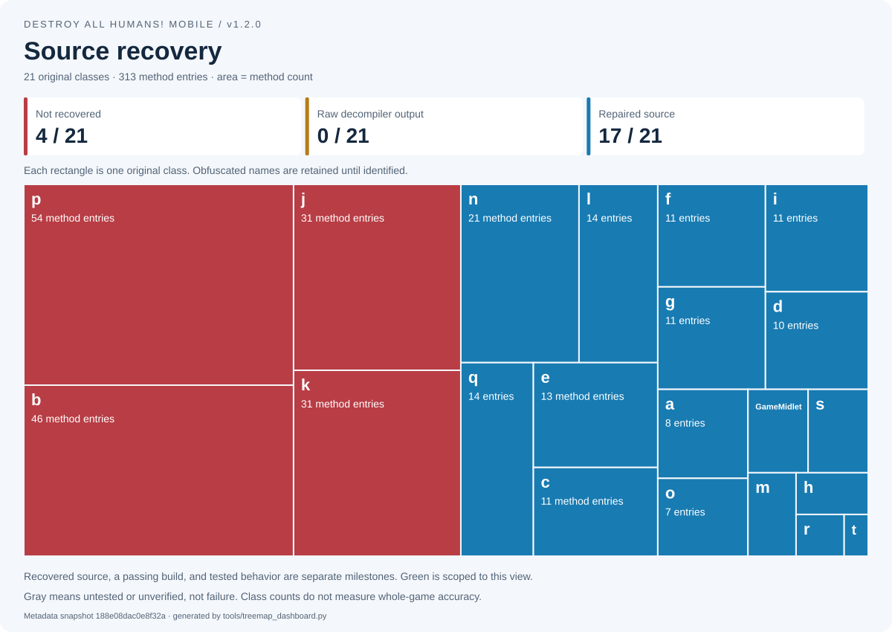
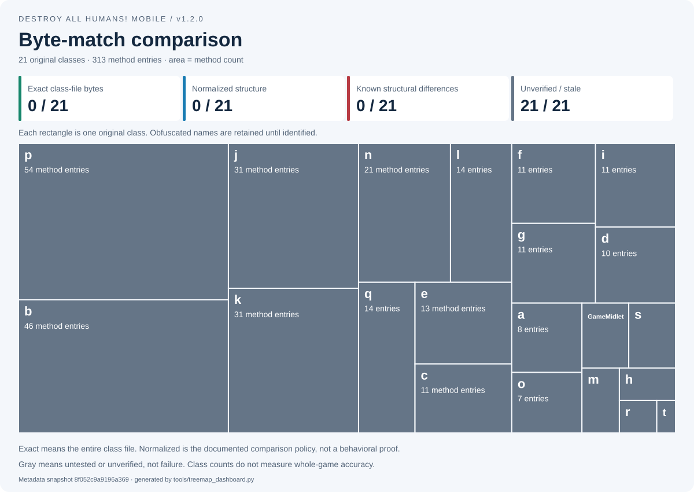

# Destroy All Humans! Mobile — Decompilation

Faithful, understandable source reconstruction of the **first Java-phone game,
version 1.2.0**, followed by a native Windows port. This is not the Xbox game,
Flash game, mobile sequel, or Crypto Does Vegas.

**Current stage: all 21 original classes have local source recovery. 19 classes
(228 method entries) are repaired; b is the newest repaired world-manager class.
k and p remain complete raw decompiler output awaiting repair. There is still no
complete behavior-validated game or native Windows port.**

[**Latest reviewed recovery: world manager b**](docs/evidence/RECOVERY_PASS_008.md) · [**Raw all-class decompiler pass**](docs/evidence/DECOMPILER_PASS_007.md)

## Latest recovery pass

Promoted world manager **b** from raw output to repaired source. A real CFR
actor-spawn reconstruction error was corrected against original bytecode and
Vineflower. The repaired class compiles in the all-source tree, and 400,002
scoped observations per side match for mission-state calculations, alert
transitions, visible-cell bounds and grid/collision lookup. k/p remain raw.

## Visual progress

[**Open the visual dashboard**](docs/VISUAL_PROGRESS.md) · [Detailed source map](docs/SOURCE_TREE.md) · [Byte-match policy](docs/BYTE_MATCH.md)





Each rectangle is an original class; its area represents the original method-entry
count. Red in recovery means not recovered. Gray in comparison means unverified,
not failure. Green exact-byte matches and blue normalized matches remain separate
from behavioral accuracy. The dashboard also contains build and behavior views.

**Nineteen classes now have repaired source and scoped build/behavior evidence;
k/p remain raw decompiler output only.** Test support remains separate from rebuilt
artifacts. No whole-class exact/normalized match is claimed, and the global
byte-match report remains unselected.

The images are generated from our recorded evidence, not hand-colored. The
`Progress dashboard` workflow refreshes them on `main` after validation; pull
requests check that generated files are current. No game binary is needed by CI.

## Source tree and progress

Open the **[source tree and implementation map](docs/SOURCE_TREE.md)** for the
actual tracked files, all 21 original classes, and separate recovery, build, and
behavior records. Planned systems are kept separate from implemented tooling.

The map is generated and checked locally:

```console
python tools/source_map.py
python tools/source_map.py --check
```

See [the maintenance guide](docs/SOURCE_MAP_GUIDE.md) before updating statuses.

## Working here

Python 3.10 or newer runs the current tools, with no third-party Python packages.
Run commands from the repository root. On Windows, `py -3` can replace `python`.

```console
python -m unittest discover -s tests -v
```

The tests use independently authored synthetic fixtures. Passing them verifies
parts of the tooling, not the complete game. Some tooling tests use an installed
JDK; actual component comparisons are a separate command with local game inputs.

For the real audit, supply your own exact input at:

```text
inputs/original/Destroy-All-Humans_J2ME_EN_v120.jar
```

That directory is ignored by Git. The tool rejects other builds by size and
SHA-256; the identity and expected counts are in `config/target.json`.

```console
python tools/dah1.py verify
python tools/dah1.py audit --output local/audit.json
```

Alternatively pass `--input "path/to/game.jar"`. An existing output file is never
overwritten; choose a new report name for each run. Auditing parses structure
without extracting or executing game code. It is not a complete JVM verifier.

For the seventeen recovered components, restore the reviewed private source snapshots
under `src/game/`, use a JDK supporting `--release 8`, and choose new run directories:

```console
python tools/weapon_recovery.py --run-dir local/weapon-next-run
python tools/collection_recovery.py --run-dir local/collection-next-run
python tools/entity_recovery.py --run-dir local/entity-next-run
python tools/subsystem_recovery.py --run-dir local/subsystem-next-run
python tools/component_recovery.py --run-dir local/component-next-run
```

The first command compiles seventeen components and compares weapon/saucer/lifecycle
integration. The remaining commands preserve the fourteen-class collection/building,
eleven-class effects/entity/pickup,
six-class audio/font/navigation, and three-class helper regression scopes.
None builds the complete game, downloads a decompiler, uploads game data, or
compiles a native executable. See the reports for exact test boundaries.

## Repository boundaries

- `tools/`, `tests/`: original project tooling and synthetic tests.
- `config/`: exact target identity, source-snapshot hashes and progress metadata.
- `docs/`: status, milestones, and the evidence required for a faithful release.
- `inputs/`, `local/`, `recovered/`, `src/game/`, `deps/`, `build/`: local-only,
  ignored paths. Create them as needed; they are not tracked directories.

This repository was public when initialized. Its visibility was not changed.
No original JAR, asset bundle, disassembly, recovered game source, or third-party
binary is committed. Review publication permissions and repository visibility
before tracking recovered source. No blanket license has been applied to game
material or to dependencies that have not yet been introduced.

## The next milestone

Use the remaining raw k/p output to repair k next, then p, preserving the
six reviewed regression suites and bytecode checks. The raw all-class compile is
a starting point, not a substitute for reviewed game logic. Real platform
services, whole-game comparisons and native compilation remain ahead.

Read [the project status](docs/STATUS.md),
[the verification contract](docs/VERIFICATION.md), and
[the workstation instructions](AGENTS.md) before changing scope or claiming progress.
