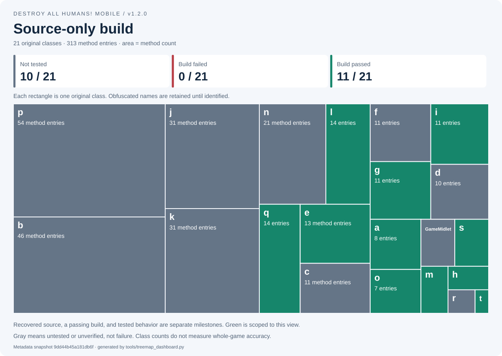
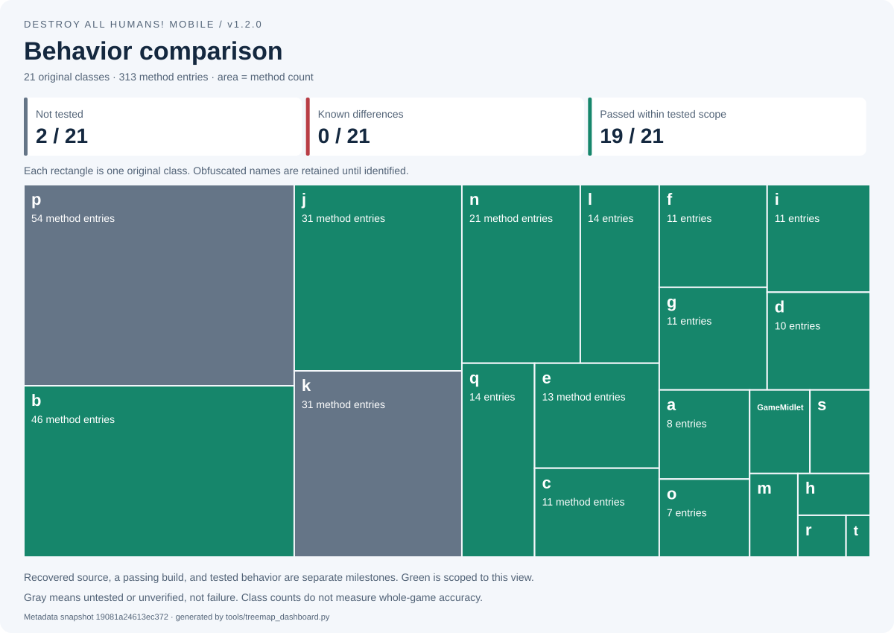

<!-- Generated by tools/treemap_dashboard.py. -->
# Visual progress dashboard

[Repository home](../README.md) · [Detailed source map](SOURCE_TREE.md) · [Comparison policy](BYTE_MATCH.md)

**Area = original method-entry count. Each box = one class. Colors = recorded status, not an accuracy score.**

## Source recovery


## Byte-match / normalized-match


No rebuilt-game comparison report has been recorded.

| Match type | Classes |
| --- | ---: |
| Exact class-file bytes | 0 / 21 |
| Normalized structure | 0 / 21 |
| Known structural differences | 0 / 21 |
| Unverified / stale | 21 / 21 |

## Source-only build



## Behavior comparison



Behavior passes apply only to documented tests. An exact artifact match does not prove that it was rebuilt from source.

## Refresh

These images use `config/source_map.json` and the comparison report selected in `config/byte_match.json`.
The generator does not run the game or manufacture comparison results. See [maintenance](SOURCE_MAP_GUIDE.md).

```console
python tools/source_map.py
python tools/treemap_dashboard.py
python tools/treemap_dashboard.py --check
```
